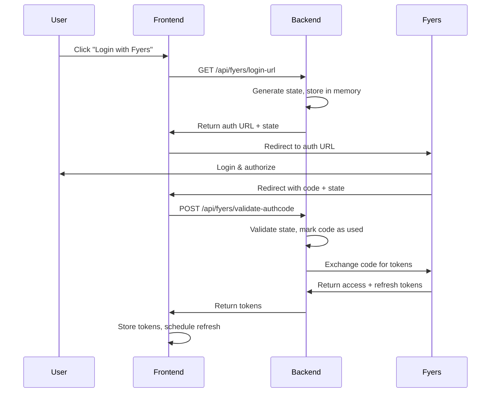

# Fyers Integration Guide

## Overview

This trading system now includes full Fyers API v3 integration with secure backend proxy authentication, automatic token refresh, and multi-broker support.

## Architecture

### Backend Proxy Pattern
- **Security**: Client secrets stored server-side only
- **Reliability**: Automatic token refresh with expiry tracking
- **Validation**: Server-side state validation prevents CSRF and code reuse

### Key Components

1. **Backend Endpoints** (`premiumtrader-backend/server.js`):
   - `GET /api/fyers/login-url` - Generate auth URL with state
   - `POST /api/fyers/validate-authcode` - Exchange code for tokens
   - `POST /api/fyers/refresh-token` - Refresh expired tokens
   - `GET /api/brokers` - List available brokers
   - `POST /api/brokers/set` - Switch active broker

2. **Frontend Service** (`src/services/FyersService.js`):
   - Proxy-first authentication with secure fallback
   - JWT expiry parsing and scheduled refresh
   - Single-use auth code guards
   - Option symbol mapping for weekly expiries

3. **React Hook** (`src/hooks/useFyersAuth.js`):
   - OAuth callback handling with state validation
   - Silent background token refresh
   - React StrictMode protection

## Environment Variables

### Backend (.env or Render environment)
```
FYERS_CLIENT_ID=YOUR_CLIENT_ID
FYERS_CLIENT_SECRET=YOUR_CLIENT_SECRET  
FYERS_REDIRECT_URL=https://yourdomain.com/fyers-callback
```

### Frontend (.env)
```
VITE_FYERS_CLIENT_ID=YOUR_CLIENT_ID
VITE_FYERS_REDIRECT_URL=https://yourdomain.com/fyers-callback
VITE_FYERS_DIRECT_FALLBACK=0  # Disable for production
```

## Fyers Developer Portal Setup

1. **App Registration**: Register your app at https://myapi.fyers.in/
2. **Redirect URL**: Must exactly match `FYERS_REDIRECT_URL`
3. **Permissions**: Ensure API v3 access is enabled
4. **IP Whitelisting**: Add your server IPs if required

## Authentication Flow



## Security Features

### Protection Against
- **Code Reuse**: Server-side tracking prevents duplicate exchanges
- **CSRF Attacks**: State parameter validation
- **Token Exposure**: Secrets never reach client browser
- **Session Hijacking**: Short-lived tokens with automatic refresh

### Guards Implemented
- sessionStorage single-use guards (client-side)
- Server-side used code tracking
- State parameter validation with TTL
- Early URL parameter cleanup

## Token Management

### Storage
- `localStorage.fyers_access_token` - Combined clientId:token
- `localStorage.fyers_refresh_token` - Refresh token
- `localStorage.fyers_access_expiry` - Unix timestamp
- `localStorage.fyers_state` - OAuth state (temporary)

### Refresh Strategy
- JWT expiry parsing from access token
- Scheduled refresh 2 minutes before expiry
- Single-flight refresh to prevent race conditions
- Automatic retry on 401/-8/-15 error codes

## Error Handling

### Common Error Codes
- `-437`: Invalid auth code (already used/expired)
- `-8, -15, -16, -17`: Token expired (triggers refresh)
- `401`: Unauthorized (triggers refresh attempt)

### Enhanced Error Messages
```javascript
// Server returns structured errors with reason codes
{
  "error": "Auth code already used",
  "reason": "code_reused",
  "code": -437,
  "message": "invalid auth code",
  "s": "error"
}
```

## Broker Integration

### Multi-Broker Support
The system supports multiple brokers through a unified interface:

```javascript
// Available brokers
const brokers = [
  { id: 'zerodha', name: 'Zerodha', isAvailable: true },
  { id: 'breeze', name: 'ICICI Breeze', isAvailable: false },
  { id: 'fyers', name: 'Fyers', isAvailable: true }
];
```

### Broker Selection
- UI component: `src/components/BrokerSelector.jsx`
- Service: `src/services/AuthService-new.js`
- Backend routes: `/api/brokers`, `/api/brokers/set`

## Option Trading Support

### Symbol Mapping
Fyers weekly option expiry encoding:
- Jan-Sep: 1,2,3,4,5,6,7,8,9
- Oct-Dec: O,N,D

Example: `NIFTY24O1015000CE` (Oct 2024, 15000 Call)

## Deployment

### Render.com Configuration
1. **Environment Variables**: Set in Render dashboard
2. **Build Command**: `npm install && npm run build`
3. **Start Command**: `npm start`
4. **Auto-Deploy**: Enable for main branch

### Health Checks
- Backend: `GET /api/brokers` should return 200
- Fyers availability: Check `isAvailable: true` in response

## Troubleshooting

### Common Issues

**Fyers not in dropdown**:
- Check backend environment variables loaded
- Verify `FYERS_CLIENT_ID` is set
- Check `/api/brokers` response

**Persistent -437 errors**:
- Clear all `fyers_*` localStorage/sessionStorage
- Verify redirect URL matches Fyers portal exactly
- Check client ID and secret are correct

**Token refresh failures**:
- Verify `scope: 'openid profile offline_access'` in auth URL
- Check refresh token stored correctly
- Monitor server logs for refresh attempts

### Debug Tools
- Browser DevTools → Network tab
- Server console logs with `[FYERS PROXY]` prefix
- Frontend console logs with `[FYERS]` prefix

## API Reference

### FyersService Methods
```javascript
// Authentication
await fyersService.getAuthUrl()           // Get auth URL
await fyersService.getAccessToken(code)   // Exchange code
await fyersService.refreshAccessToken()   // Refresh tokens

// Trading
await fyersService.getProfile()           // User profile
await fyersService.getHistoricalData()    // Historical data
await fyersService.getMarketStatus()      // Market status
await fyersService.getOptionChain()       // Option chain
```

### Backend Endpoints
```javascript
GET    /api/fyers/login-url              // Generate auth URL
POST   /api/fyers/validate-authcode      // Token exchange  
POST   /api/fyers/refresh-token          // Token refresh
GET    /api/brokers                      // List brokers
POST   /api/brokers/set                  // Set active broker
```

## Production Checklist

- [ ] Environment variables set in Render
- [ ] Frontend secret removed (`VITE_FYERS_CLIENT_SECRET`)
- [ ] Direct fallback disabled (`VITE_FYERS_DIRECT_FALLBACK=0`)
- [ ] Redirect URL matches Fyers portal exactly
- [ ] HTTPS enforced for production domain
- [ ] Server logs monitored for errors
- [ ] Health checks configured

## Support

For issues with this integration:
1. Check server and browser console logs
2. Verify environment variable configuration
3. Test with fresh login (cleared storage)
4. Compare redirect URLs between code and Fyers portal

For Fyers API issues:
- Documentation: https://myapi.fyers.in/docsv3
- Support: Fyers developer portal